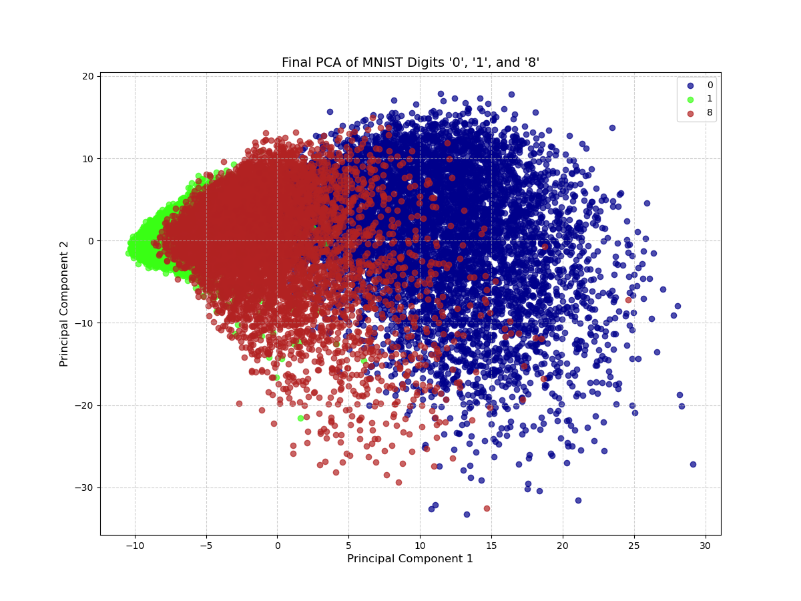

# Principal Component Analysis (PCA) from Scratch on MNIST Digits

## Project Overview

This project is a step-by-step implementation of Principal Component Analysis (PCA) from scratch using only the NumPy library. The goal is to reduce the dimensionality of the MNIST dataset (specifically for digits '0', '1', and '8') from 784 dimensions (28x28 pixels) down to 2 principal components and to visualize the result.

This exercise demonstrates a fundamental understanding of PCA's underlying mechanics.

## Key Concepts Implemented

* **Data Standardization:** Scaling data to have a mean of 0 and a standard deviation of 1.
* **Covariance Matrix:** Understanding the relationships and variance between features (pixels).
* **Eigen-decomposition:** Calculating eigenvectors and eigenvalues to find the principal components.
* **Data Projection:** Transforming the high-dimensional data into a new, lower-dimensional feature space.

## Final Visualization

The final output of the script is a 2D scatter plot where each point represents an image, colored by its original digit class. The plot clearly shows how PCA can find a lower-dimensional representation that successfully separates the different classes.



## How to Run This Project

1.  **Clone the repository:**
    ```bash
    git clone [https://github.com/](https://github.com/)[Your-GitHub-Username]/pca_mnist_project.git
    cd pca_mnist_project
    ```

2.  **Install the required libraries:**
    ```bash
    pip install -r requirements.txt
    ```

3.  **Run the script:**
    ```bash
    python pca_mnist.py
    ```

## Code

The complete, commented code is available in the `The_Geometry_of_Data_.ipynb` file.

---
*This project was developed as part of a guided learning session.*